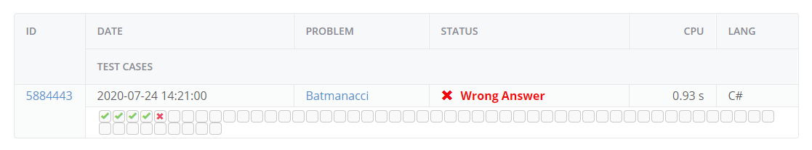

# IMBOREDD

## Overview
This is a repository full of all of the code I used to solve a series of programming puzzles in a competition that I'm not actually in but heyo, what can you do? All of the problems are from the site [Kattis, Kattis](https://open.kattis.com/). Each of the problems is separately linked.

The repo is all under an MIT licence so feel free to do whatever you want with the code, not that useful anyways.

## Completed Problems

### [Problem A - Batmanacci](https://open.kattis.com/problems/batmanacci)

#### Overview

This problem featured the Batmanacci sequence which is a string concatenation version of the Fibonacci sequence so it looks like this: \[\'N\', \'A\', \'NA\', 'ANA\', \'NAANA\', \'ANANAANA\', ...\] and continues to an infinite number of terms. For more information on the sequence see the [original challenge](https://open.kattis.com/problems/batmanacci). The idea of the challenge is that the program is given 2 numbers; the first one, N (1≤N≤10^5), signals that term of the Batmanacci sequence and the second, K (1≤K≤10^18), refers to a specific character in the term defined by N. The tasks is to determine what the character, defined by the inputs N and K, is.

#### Experimentation Phase

The first thing That I did was to write a program to see if I could generate all the strings up to the 10^5th term of the sequence. The simple method I wrote runs out of memory well before it reaches the 100th term of the sequence so that was unlikely to be able to produce the result for any number within the limits. However this method was not a waste of time as I now had a program that could print out the first x terms of the Batmanacci sequence like so:

`[N, A, NA, ANA, NAANA, ANANAANA, NAANAANANAANA, ANANAANANAANAANANAANA, NAANAANANAANAANANAANANAANAANANAANA, ANANAANANAANAANANAANANAANAANANAANAANANAANANAANAANANAANA]`

The code to find this sequence is still in the program and can be called from the main function of the program class by calling 
`Console.WriteLine(arrayToString(getBatmanacci(1, 16)));`

Using the previously found first 10 terms of the sequence I noticed that the sequence always alternates what the start term is but the final term is always A however besides finding more evidence that the structure of the terms is recursive (something that is clear from the algorithm to generate each term) I wasn't able to find anything useful.

##### Solution Theory

Given this I then went back to first principles and started with the main concept generalizing the sequence a little more, then after looking at the first 10 terms on paper for a moment and really drilling down into the recursive nature I realized that because it is built on the idea of the Fibonacci sequence the length of each of each term is that of the corresponding Fibonacci term. Knowing this it makes my early attempts at a brute force system look utterly futile as the 10,000th term should be as long as the 10,000th number of the fibonacci sequence which is:

`33644764876431783266621612005107543310302148460680063906564769974680081442166662368155595513633734025582065332680836159373734790483865268263040892463056431887354544369559827491606602099884183933864652731300088830269235673613135117579297437854413752130520504347701602264758318906527890855154366159582987279682987510631200575428783453215515103870818298969791613127856265033195487140214287532698187962046936097879900350962302291026368131493195275630227837628441540360584402572114334961180023091208287046088923962328835461505776583271252546093591128203925285393434620904245248929403901706233888991085841065183173360437470737908552631764325733993712871937587746897479926305837065742830161637408969178426378624212835258112820516370298089332099905707920064367426202389783111470054074998459250360633560933883831923386783056136435351892133279732908133732642652633989763922723407882928177953580570993691049175470808931841056146322338217465637321248226383092103297701648054726243842374862411453093812206564914032751086643394517512161526545361333111314042436854805106765843493523836959653428071768775328348234345557366719731392746273629108210679280784718035329131176778924659089938635459327894523777674406192240337638674004021330343297496902028328145933418826817683893072003634795623117103101291953169794607632737589253530772552375943788434504067715555779056450443016640119462580972216729758615026968443146952034614932291105970676243268515992834709891284706740862008587135016260312071903172086094081298321581077282076353186624611278245537208532365305775956430072517744315051539600905168603220349163222640885248852433158051534849622434848299380905070483482449327453732624567755879089187190803662058009594743150052402532709746995318770724376825907419939632265984147498193609285223945039707165443156421328157688908058783183404917434556270520223564846495196112460268313970975069382648706613264507665074611512677522748621598642530711298441182622661057163515069260029861704945425047491378115154139941550671256271197133252763631939606902895650288268608362241082050562430701794976171121233066073310059947366875`

All of this means that the last string of the sequence would have taken over thirty-three quinnonagintasescentillion (33x10^4179) bytes to store, assuming ASKII encoding. This would take roughly 1.1405x10^4139 times the world's entire digital storage capacity ([295 exabytes](https://www.zdnet.com/article/what-is-the-worlds-data-storage-capacity/)) to hold.

However we can now use this knowledge about the size of each term to find the location of specific characters in the term, for instance lets take the second term but rather than represent it as 'NA' lets instead represent it as A + B (+ symbolizes concatenation) where A and B are the first and second terms of the sequence respectively. If we want to find a term from this number rather than computing the term we can look at where that term exists in the 2 terms that form it, so if it's the second digit of the 3rd term we want then we know to look in the 1st digit of the 2nd term to find out what letter that is. This method can be extrapolated to the other terms as every term is the concatenation of the previous 2, meaning that all that needs to be computed is the Fibonacci sequence up to the 10,000th digit which is possible with the resources provided.

#### Development of the Solution

The development went well until very near the end when there was a fatal flaw with the program that meant it was failing test 5 of the Kattis submission system. 

Seeing as I couldn't ask for the data that the system was using to test (that would undermine their testing system) I had to work out what was causing this issue. I started by cross referencing all the information that I had from the brute force method and did this to my system memory:

All of the tests eventually passed and this drove me up the wall as I couldn't for the life of me think what was going wrong. 2 hours later and it turns out I was parsing the value of K to an integer and ignoring all the errors that the integer parsing process produced when I tried to parse anything greater than 2147483647 (maximum value for a 32-bit integer in C#). One quick upgrade to using the BigInteger object in the System.Numerics library of C# and the system worked and passed all tests as shown below.

### Attribution

This task was created by authors [Tómas Ken Magnússon](https://open.kattis.com/problem-authors/T%C3%B3mas%20Ken%20Magn%C3%BAsson) and [Bjarki Ágúst Guðmundsson](https://open.kattis.com/problem-authors/Bjarki%20%C3%81g%C3%BAst%20Gu%C3%B0mundsson) and is published by [Reykjavík University ÁFLV 2016](https://open.kattis.com/problem-sources/Reykjav%C3%ADk%20University%20%C3%81FLV%202016). It is under the [Attribution 3.0 Unported (CC BY 3.0)](https://creativecommons.org/licenses/by/3.0/) licence.

## In Progress Problems

### [Problem B - Bee House Perimeter](https://open.kattis.com/problems/beehouseperimeter)